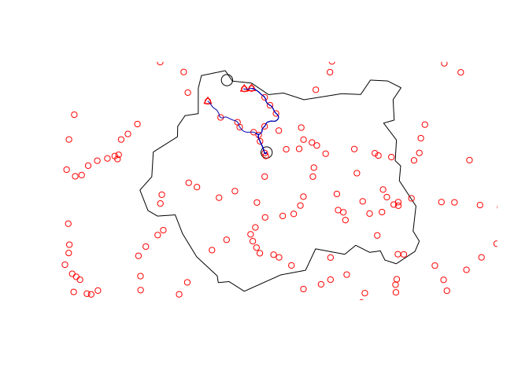

<!-- README.md is generated from README.Rmd. Please edit that file -->

# 1 Estimating cycling potential to rail stations

<!-- badges: start -->
<!-- [](https://github.com/npct/rail/actions/workflows/render-rmarkdown.yaml) -->
<!-- badges: end -->

The goal of this repo is to explore methods for calculating cycling
potential to public transport nodes, rail stations in the first
instance.

# 2 OD data

The input data consists of origin-destination pairs. These can be
obtained from a range of sources. We will use open OD data from the 2011
UK Census to demonstrate the methods. A random sample of OD pairs from
the national dataset is shown below.

| geo_code1 | geo_code2 | all | from_home | light_rail | train | bus | taxi | motorbike | car_driver | car_passenger | bicycle | foot | other | geo_name1        | geo_name2          | la_1         | la_2           |
|:----------|:----------|----:|----------:|-----------:|------:|----:|-----:|----------:|-----------:|--------------:|--------:|-----:|------:|:-----------------|:-------------------|:-------------|:---------------|
| E02004474 | E02000916 |   2 |         0 |          0 |     0 |   0 |    0 |         0 |          2 |             0 |       0 |    0 |     0 | Castle Point 002 | Waltham Forest 022 | Castle Point | Waltham Forest |
| E02000512 | E02003707 |   2 |         0 |          0 |     0 |   0 |    0 |         0 |          2 |             0 |       0 |    0 |     0 | Hillingdon 019   | Wycombe 012        | Hillingdon   | Wycombe        |
| E02000371 | E02000735 |   1 |         0 |          0 |     0 |   0 |    0 |         0 |          0 |             0 |       1 |    0 |     0 | Hackney 027      | Newham 022         | Hackney      | Newham         |

The case study region of West Yorkshire is used to subset the dataset of
2402201 OD pairs to records representing trips originating in the region
(95915 rows). In a further subsetting stage only OD pairs with more than
a threshold number of trips were kept to focus the analysis on desire
lines in which large numbers of people travel by train. Setting this
threshold to 10 people by results in 447 rows in the case study region.
These rail trips are illustrated in Figure
<a href="#fig:simpleraildesire">2.1</a> below.

<div class="figure">


<p class="caption">
Figure 2.1: Illustration of major commute desire lines originating in
West Yorkshire by any mode (black) and by rail (blue).
</p>

</div>

# 3 Rail station data

Data on rail station locations was obtained from the
[naptan.app.dft.gov.uk](http://naptan.app.dft.gov.uk) website. The
multi-stage trips from home to work via rail stations is shown in Figure
<a href="#fig:railsample">3.1</a> below. This graphic assumes
simplistically that the first stage of rail journeys was to the nearest
station, that the rail journey went to the station closes to their
destination, and that trips involve travelling in a straight line (an
assumption we will remove in the next section).

<div class="figure">


<p class="caption">
Figure 3.1: Illustration of desire lines with high numbers of rail
trips, focussing on a sample of 5, assuming straight line travel (left)
and assuming trips travel via the nearest station to the origin and
destination, showing desire lines from home locations to the nearest
stations (right).
</p>

</div>

The distribution of total trip distances and trip distances to and from
stations is shown in Figure <a href="#fig:distances">3.2</a>.


# 4 Public transport routing

The route that people will take is not necessarily the one that goes to
the closest rail station to their home. It will usually be the route
that minimises total journey time.

The total journey time can be calculated as the sum of the origin,
public transport stage, and destination stages:

*T*<sub>*j*</sub> = *T*<sub>*o*</sub> + *T*<sub>*p*</sub> + *T*<sub>*d*</sub>

The time taken for each stage varies depending on the origin and
destination station. In this example we will focus only on the choice of
the origin station. We can find the three nearest stations to each
origin as follows:

``` r
nearest_stations = nngeo::st_nn(origin, rail_stations, k = 3, progress = FALSE)
nearest_stations
#> [[1]]
#> [1] 1256 1266 1198
```

Based on this example, we can plot the three route options and show
their associated times:

<!-- -->

|      | distance_m | distance_text | duration_s | duration_text |
|:-----|-----------:|:--------------|-----------:|:--------------|
| 1-1  |      23684 | 23.7 km       |       2758 | 46 mins       |
| 1-11 |      21881 | 21.9 km       |       2406 | 40 mins       |
| 1-12 |      19656 | 19.7 km       |       2296 | 38 mins       |

# 5 Cycle routing

# 6 Scaling the methods

# 7 Discussion
