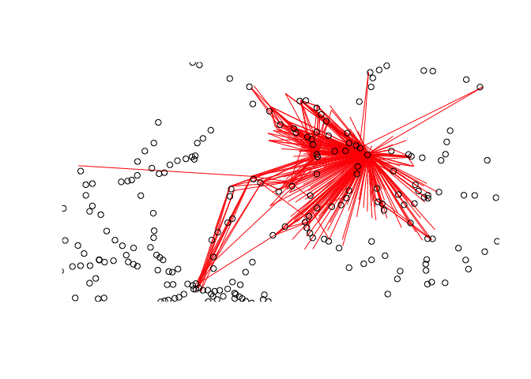

<!-- README.md is generated from README.Rmd. Please edit that file -->

# Estimating cycling potential to rail stations

<!-- badges: start -->

<!-- badges: end -->

The goal of this repo is to explore methods for calculating cycling
potential to public transport nodes, rail stations in the first
instance.

# OD data

The input data consists of origin-destination pairs. These can be
obtained from a range of sources. We will use open OD data from the 2011
UK Census to demonstrate the methods. A random sample of OD pairs from
the national dataset is shown below.

    #> No region provided. Returning national OD data.
    #> 
    #> ── Column specification ────────────────────────────────────────────────────────
    #> cols(
    #>   `Area of residence` = col_character(),
    #>   `Area of workplace` = col_character(),
    #>   `All categories: Method of travel to work` = col_double(),
    #>   `Work mainly at or from home` = col_double(),
    #>   `Underground, metro, light rail, tram` = col_double(),
    #>   Train = col_double(),
    #>   `Bus, minibus or coach` = col_double(),
    #>   Taxi = col_double(),
    #>   `Motorcycle, scooter or moped` = col_double(),
    #>   `Driving a car or van` = col_double(),
    #>   `Passenger in a car or van` = col_double(),
    #>   Bicycle = col_double(),
    #>   `On foot` = col_double(),
    #>   `Other method of travel to work` = col_double()
    #> )
    #> 
    #> ── Column specification ────────────────────────────────────────────────────────
    #> cols(
    #>   MSOA11CD = col_character(),
    #>   MSOA11NM = col_character(),
    #>   BNGEAST = col_double(),
    #>   BNGNORTH = col_double(),
    #>   LONGITUDE = col_double(),
    #>   LATITUDE = col_double()
    #> )
    #> 
    #> 
    #> ── Column specification ────────────────────────────────────────────────────────
    #> cols(
    #>   MSOA11CD = col_character(),
    #>   MSOA11NM = col_character(),
    #>   BNGEAST = col_double(),
    #>   BNGNORTH = col_double(),
    #>   LONGITUDE = col_double(),
    #>   LATITUDE = col_double()
    #> )

| geo_code1 | geo_code2 | all | from_home | light_rail | train | bus | taxi | motorbike | car_driver | car_passenger | bicycle | foot | other | geo_name1     | geo_name2     | la_1      | la_2      |
|:----------|:----------|----:|----------:|-----------:|------:|----:|-----:|----------:|-----------:|--------------:|--------:|-----:|------:|:--------------|:--------------|:----------|:----------|
| E02000431 | E02000839 |   1 |         0 |          0 |     0 |   0 |    0 |         0 |          1 |             0 |       0 |    0 |     0 | Haringey 035  | Southwark 033 | Haringey  | Southwark |
| E02000337 | E02000826 |   2 |         0 |          0 |     0 |   0 |    0 |         0 |          2 |             0 |       0 |    0 |     0 | Greenwich 025 | Southwark 020 | Greenwich | Southwark |
| E02000814 | E02000189 |   5 |         0 |          2 |     0 |   2 |    0 |         0 |          0 |             0 |       1 |    0 |     0 | Southwark 008 | Camden 024    | Southwark | Camden    |

The case study region of West Yorkshire is used to subset the data. OD
pairs with more than 50 people by any mode and with more than 50 people
travelling by rail are shown below.

    #> 0 origins with no match in zone ids
    #> 618 destinations with no match in zone ids
    #>  points not in od data removed.

<!-- -->

# Rail station data

<!-- -->

# Transit routing

# Discussion
